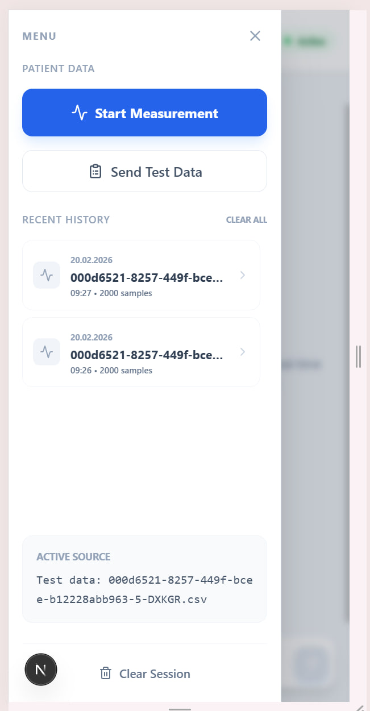
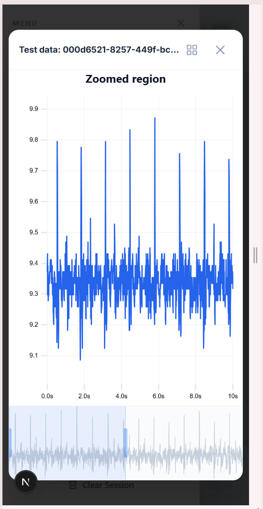
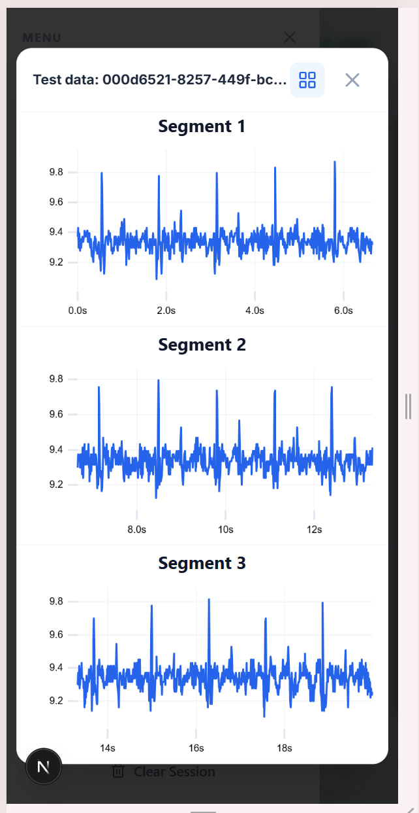

<div align="center">
  <h1>CardioAI: Your Heart's Health in Your Hands</h1>
  <p>
    <b>An AI-powered clinical support system that transforms any smartphone into a seismocardiography (SCG) device for primary heart rhythm analysis.</b>
  </p>
  <p>
    <a href="#-key-features">Key Features</a> •
    <a href="#-tech-stack">Tech Stack</a> •
    <a href="#-interface">Interface</a> •
    <a href="#-getting-started">Getting Started</a> •
    <a href="#-project-structure">Project Structure</a>
  </p>
</div>

---

<div align="center">
  
</div>

**CardioAI** is a groundbreaking web application designed for a Google competition, demonstrating how AI can make primary cardiac diagnostics more accessible. By leveraging the built-in accelerometers in modern smartphones, CardioAI captures and analyzes seismocardiograms (SCG) — the subtle chest vibrations created by the heart's mechanical functions. This provides a non-invasive, cost-effective, and readily available method for preliminary heart rhythm assessment.

Our system combines a sophisticated **FastAPI** backend for AI orchestration with a responsive, mobile-first **Next.js** frontend, delivering a seamless experience for both clinicians and patients.

## ✨ Key Features

<div align="center">
  
</div>

- **AI-Powered Chat:** An intuitive chat interface where clinicians can upload measurement data and receive instant analysis and insights from a medical Large Language Model (LLM).
- **Real-Time Data Capture:** Perform live SCG measurements directly in the browser using the smartphone's accelerometer.
- **Measurement History & Storage:** All measurements are automatically saved in the browser's **Local Storage**. A clean, accessible history panel allows for quick review and re-analysis of past recordings.
- **Advanced Signal Visualization:**
  - **Full-Screen Interactive Viewer:** A powerful, full-screen modal for detailed signal analysis.
  - **Dual-Mode Display:** Switch between **Standard View** (a zoomed-in chart with a full-signal overview for navigation) and **Split View** (three sequential charts for in-depth analysis of different signal segments).
  - **Mobile-First & Touch-Friendly:** The entire visualization interface is optimized for mobile devices, with large touch targets and intuitive gesture-based navigation (drag, resize, and zoom).

<div align="center">
  
</div>

- **Seamless Backend Integration:** The frontend communicates with a powerful backend that orchestrates calls to specialized signal analysis APIs and medical LLMs.

## 🛠️ Tech Stack

| Area | Technology | Purpose |
| :--- | :--- | :--- |
| **Frontend** | [**Next.js**](https://nextjs.org/) (React) | SSR, fast performance, and a modern UI. |
| | [**Tailwind CSS**](https://tailwindcss.com/) | For a utility-first, responsive design. |
| | [**uPlot**](https://github.com/leeoniya/uPlot) | A fast, memory-efficient, and powerful charting library for signal visualization. |
| | [**shadcn/ui**](https://ui.shadcn.com/) & [**Radix**](https://www.radix-ui.com/) | For accessible, unstyled UI components (Dialogs, Buttons). |
| | [**Lucide React**](https://lucide.dev/) | For consistent and beautiful icons. |
| **Backend** | [**FastAPI**](https://api.tiangolo.com/) | High-performance Python framework for building APIs. |
| | **Dr7.ai & HeartScan API** | Specialized APIs for medical LLM insights and SCG signal processing. |
| **Deployment**| [**Vercel**](https://vercel.com/) & [**Render**](https://render.com/) | For seamless, scalable deployment of frontend and backend. |

## 🏁 Getting Started

To get a local copy up and running, follow these simple steps.

### Prerequisites

- Python 3.8+
- Node.js 18.17+
- `pip` and `npm`

### Installation & Startup

1.  **Clone the repository:**
    ```sh
    git clone https://github.com/HeartScan/CardioAI.git
    cd CardioAI
    ```
2.  **Configure Backend:**
    - Navigate to `cardioai_backend/`.
    - Create a `.env` file from `.env.example` and add your API keys (`HEARTSCAN_API_KEY`, `DR7_API_KEY`).
    - Run the backend:
      ```sh
      python -m venv venv
      source venv/bin/activate # On Windows: venv\Scripts\activate
      pip install -r requirements.txt
      python main.py
      ```
3.  **Configure Frontend:**
    - Navigate to `cardioai_frontend/`.
    - Create a `.env.local` file from `.env.example` and set `NEXT_PUBLIC_CARDIOAI_BACKEND_URL=http://localhost:8000`.
    - Run the frontend:
      ```sh
      npm install
      npm run dev
      ```
4.  Open [http://localhost:3000](http://localhost:3000) in your browser.

## 📂 Project Structure

```
.
├── cardioai_backend/     # FastAPI application
│   ├── api/              # API endpoints (e.g., chat)
│   ├── services/         # Business logic (HeartScan, Dr7 integration)
│   └── main.py           # Main application entrypoint
│
├── cardioai_frontend/    # Next.js application
│   ├── app/              # Main app router directory
│   │   └── cardio-ai/    # The main application page
│   ├── components/       # Reusable React components
│   │   ├── SignalViewer.tsx  # Main signal visualization component
│   │   └── ChartWorkspace.tsx # Logic for high/low res modes
│   └── lib/              # Utility functions and libraries
│
└── README.md
```

## 📚 Educational Resources & Open Source

### Seismocardiography (SCG)
*   **[What is SCG?](https://heartscan.app/about-scg)** — A detailed explanation of capturing cardiac mechanical vibrations using an accelerometer. Unlike ECG (electrical signals), SCG measures the mechanical work of the heart (valve opening/closing, ventricular contraction).
*   **[Interpretation Guide](https://heartscan.app/primary-care-guide)** — A practical visual guide to SCG waveforms for primary care physicians. It helps in recognizing patterns (PAC, PVC, Atrial Fibrillation) based on mechanical signals.

### Open Source Initiative
*   **[OpenSCG](https://github.com/HeartScan/openSCG)** — An open-source infrastructure project aiming to turn any smartphone into a seismocardiography sensor, removing hardware cost barriers in telemedicine.

---
*Disclaimer: This application is for demonstration purposes only and is not a certified medical device.*
